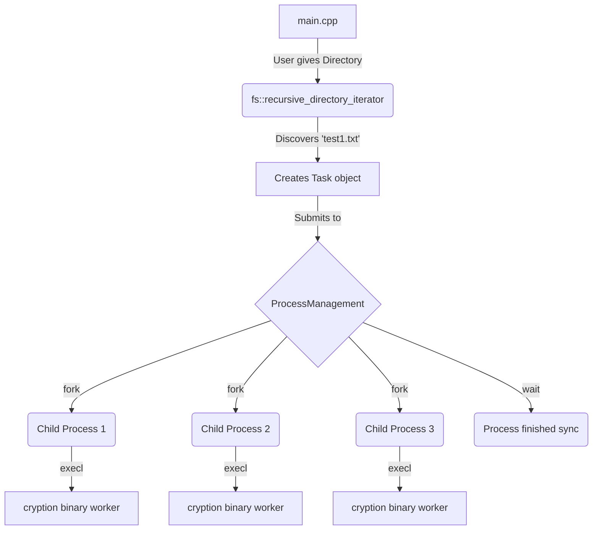

# 🔐 FileCipher


**FileCipher** is a blindingly fast, lightweight C++ utility designed to encrypt and decrypt entire directories of files concurrently. 

Unlike traditional file processors that freeze while processing multiple assets sequentially, FileCipher utilizes native operating system multiprocessing primitives (`fork()` and `execl()`) to spawn isolated parallel background processes. This effectively enables concurrent folder-wide encryption, making it exponentially faster when dealing with thousands of documents simultaneously!

## 🚀 Features

- **Blazing Fast Multiprocessing**: Dispatches tasks to parallel OS threads for true concurrency.
- **Background Synchronization**: Parent process safely tracks all spawned child workers and halts seamlessly until background operations conclude, preventing zombie processes.
- **Intuitive Directory Iteration**: Targets an entire folder hierarchy deeply.
- **Robust POSIX API Usage**: Leverages advanced Unix-based thread logic.
- **Separation of Concerns**: Completely segregates worker memory and code using `execl()`, running lightweight `cryption` binaries separately from the main routing thread.

## 🧠 Architecture Overview

Here is a simple look at the underlying architecture:



## ⚙️ Compilation & Prerequisites

_Note: This tool strongly relies on POSIX standards (`<unistd.h>`, `<sys/wait.h>`). For Windows users, it is **highly recommended** to compile and run this securely through **WSL (Ubuntu)**._

### Build Instructions

1. Ensure `g++` and `make` are installed on your Linux / WSL environment.
2. Initialize build:
   ```bash
   make
   ```
3. You should see two executables cleanly generated: `encrypt_decrypt` (the main router) and `cryption` (the worker binary).

### 🧪 Generating Test Assets

You can run the included Python script to rapidly spin up 100 dummy `.txt` files containing randomized tokens inside a `test/` directory to play around with!

```bash
python makeDirs.py
```

## 🎮 Usage

Run the primary binary. It will prompt you for the directory to target, and the desired action.

```bash
./encrypt_decrypt
```
**Example Interaction:**
```
Enter the directory path: test
Enter the action (encrypt/decrypt): encrypt
Starting the encryption/decryption at: 2026-06-27 19:04:40
Entering the parent process
Entering the parent process... 
Processing tasks... Please wait while background operations complete.
All background processes finished.
```

---

*Built for speed and robust file handling by Sahil Gupta (@sahilgupta630).*
